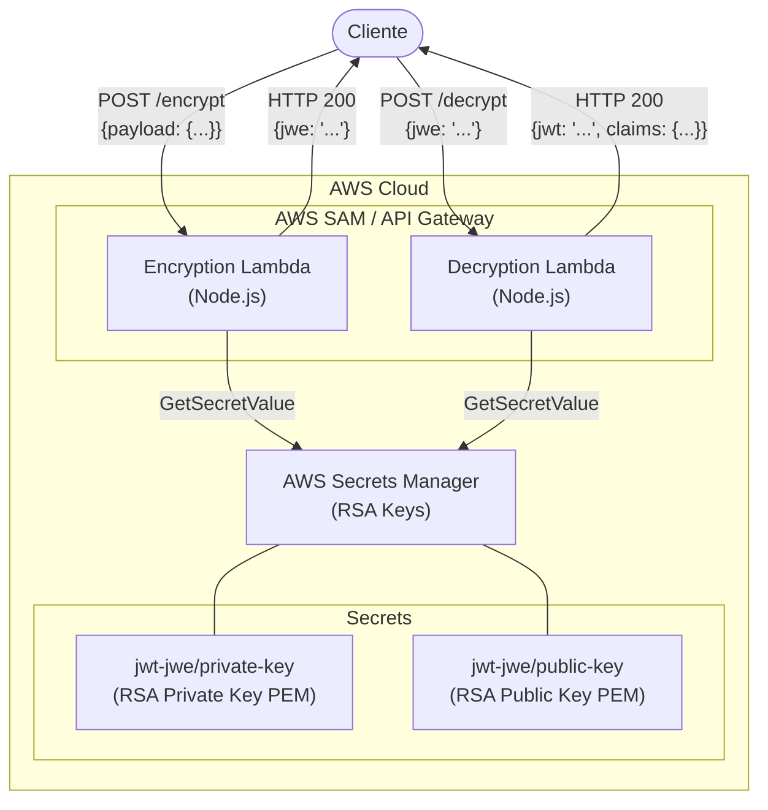
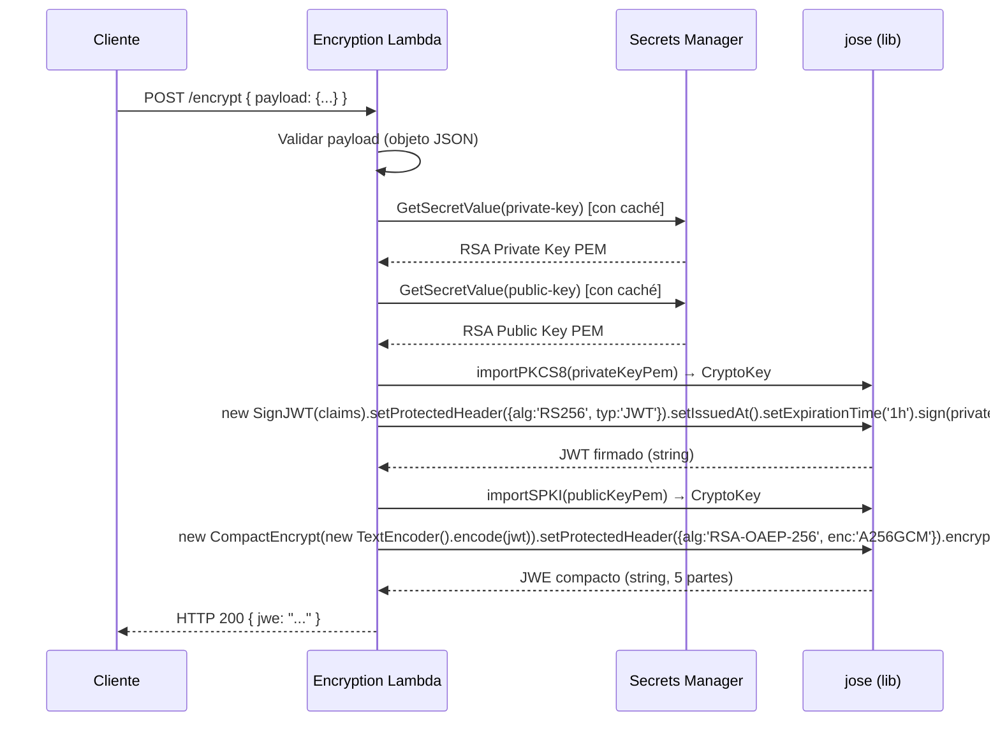
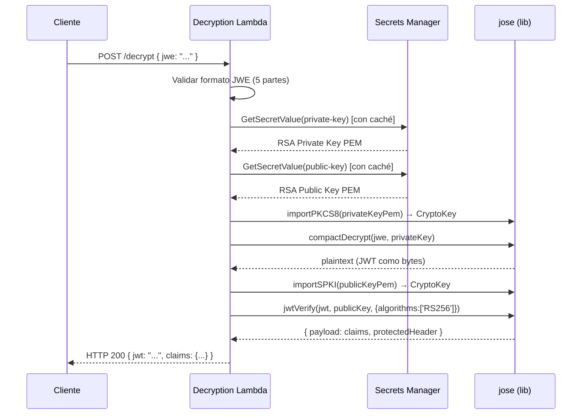

# Documento de Diseño Técnico: jwt-jwe-lambdas

## Resumen de Investigación

**Librería criptográfica**: [`jose`](https://www.npmjs.com/package/jose) (panva/jose) — módulo JavaScript para JSON Object Signing and Encryption. Soporta nativamente RS256, RSA-OAEP-256 y A256GCM en Node.js usando la API de criptografía nativa. Es la opción más mantenida y estándar para JWT/JWE en el ecosistema Node.js.

**Property-Based Testing**: [`fast-check`](https://www.npmjs.com/package/fast-check) — framework de PBT compatible con Jest sin integración especial. Permite generar inputs arbitrarios (objetos JSON, strings, números) y verificar propiedades universales.

**Gestión de claves**: AWS Secrets Manager con el [AWS Parameters and Secrets Lambda Extension](https://docs.aws.amazon.com/secretsmanager/latest/userguide/retrieving-secrets_lambda.html) para caché en memoria durante el ciclo de vida del contenedor Lambda, reduciendo latencia y costos de API.

---

## Overview

El sistema implementa un flujo criptográfico de dos etapas usando dos AWS Lambda Functions independientes y sin estado:

1. **Encryption Lambda**: Recibe un payload JSON → construye y firma un JWT (RS256) → encripta el JWT como JWE (RSA-OAEP-256 + A256GCM) → retorna el JWE compacto.
2. **Decryption Lambda**: Recibe un JWE compacto → desencripta el JWE (RSA-OAEP-256 + A256GCM) → verifica la firma del JWT (RS256) → retorna el JWT y sus claims.

Las claves RSA se almacenan en AWS Secrets Manager y se recuperan en tiempo de ejecución con caché en memoria por contenedor Lambda.

```
Cliente → [payload JSON] → Encryption Lambda → [JWE compacto] → Decryption Lambda → [JWT + claims]
```

---

## Architecture

### Diagrama de Alto Nivel



### Flujo de Datos Detallado

#### Encryption Lambda



#### Decryption Lambda



---

## Components and Interfaces

### Estructura de Directorios del Proyecto

```
jwt-jwe-lambdas/
├── template.yaml                    # AWS SAM template
├── terraform/
│   ├── main.tf                      # Recursos principales (Secrets Manager, IAM)
│   ├── variables.tf
│   └── outputs.tf
├── src/
│   ├── encryptor/
│   │   ├── handler.js               # Entry point Lambda Encriptación
│   │   ├── jwtSigner.js             # Lógica de firma JWT
│   │   ├── jweEncryptor.js          # Lógica de encriptación JWE
│   │   └── validator.js             # Validación de input
│   ├── decryptor/
│   │   ├── handler.js               # Entry point Lambda Desencriptación
│   │   ├── jweDecryptor.js          # Lógica de desencriptación JWE
│   │   ├── jwtVerifier.js           # Lógica de verificación JWT
│   │   └── validator.js             # Validación de input
│   └── shared/
│       ├── keyStore.js              # Abstracción de AWS Secrets Manager con caché
│       └── errors.js                # Clases de error personalizadas
├── tests/
│   ├── unit/
│   │   ├── encryptor/
│   │   │   ├── handler.test.js
│   │   │   ├── jwtSigner.test.js
│   │   │   └── jweEncryptor.test.js
│   │   ├── decryptor/
│   │   │   ├── handler.test.js
│   │   │   ├── jweDecryptor.test.js
│   │   │   └── jwtVerifier.test.js
│   │   └── shared/
│   │       └── keyStore.test.js
│   ├── property/
│   │   ├── encryptor.property.test.js   # PBT para Encryption Lambda
│   │   └── decryptor.property.test.js   # PBT para Decryption Lambda
│   └── fixtures/
│       ├── keys/
│       │   ├── test-private.pem         # Clave privada RSA para tests
│       │   └── test-public.pem          # Clave pública RSA para tests
│       └── testHelpers.js
├── package.json
└── jest.config.js
```

### Contratos de Interfaces Lambda

#### Encryption Lambda

**Input (API Gateway Event)**:
```json
{
  "body": "{\"payload\": { ...cualquier objeto JSON... }}"
}
```

**Output exitoso (HTTP 200)**:
```json
{
  "statusCode": 200,
  "headers": { "Content-Type": "application/json" },
  "body": "{\"jwe\": \"eyJhbGciOiJSU0EtT0FFUC0yNTYiLCJlbmMiOiJBMjU2R0NNIn0...\"}"
}
```

**Output de error**:
```json
{
  "statusCode": 400 | 500,
  "headers": { "Content-Type": "application/json" },
  "body": "{\"error\": \"Descripción del error\"}"
}
```

| Condición de error | statusCode | Mensaje |
|---|---|---|
| `payload` ausente o no es objeto JSON | 400 | `"El campo 'payload' es requerido y debe ser un objeto JSON válido"` |
| Fallo al recuperar RSA_Private_Key | 500 | `"Error al recuperar la clave de firma del Key Store"` |
| Fallo al recuperar RSA_Public_Key | 500 | `"Error al recuperar la clave de encriptación del Key Store"` |

#### Decryption Lambda

**Input (API Gateway Event)**:
```json
{
  "body": "{\"jwe\": \"eyJhbGciOiJSU0EtT0FFUC0yNTYiLCJlbmMiOiJBMjU2R0NNIn0...\"}"
}
```

**Output exitoso (HTTP 200)**:
```json
{
  "statusCode": 200,
  "headers": { "Content-Type": "application/json" },
  "body": "{\"jwt\": \"eyJhbGciOiJSUzI1NiIsInR5cCI6IkpXVCJ9...\", \"claims\": { ...claims decodificados... }}"
}
```

**Output de error**:

| Condición de error | statusCode | Mensaje |
|---|---|---|
| `jwe` ausente o formato inválido (≠ 5 partes) | 400 | `"El campo 'jwe' es requerido y debe ser un JWE en formato compacto"` |
| Fallo al recuperar RSA_Private_Key | 500 | `"Error al recuperar la clave de desencriptación del Key Store"` |
| Fallo al recuperar RSA_Public_Key | 500 | `"Error al recuperar la clave de verificación del Key Store"` |
| JWE no puede ser desencriptado | 422 | `"Error al desencriptar el JWE: token inválido o clave incorrecta"` |
| Firma JWT inválida | 401 | `"Firma del JWT inválida"` |
| JWT expirado | 401 | `"El token JWT ha expirado"` |

### Interfaces de Módulos Internos

#### `src/shared/keyStore.js`

```javascript
/**
 * Recupera y cachea las claves RSA desde AWS Secrets Manager.
 * El caché persiste durante el ciclo de vida del contenedor Lambda.
 */

// Caché a nivel de módulo (persiste entre invocaciones del mismo contenedor)
let cachedKeys = null;

/**
 * @returns {Promise<{privateKey: CryptoKey, publicKey: CryptoKey}>}
 * @throws {KeyStoreError} si no se pueden recuperar las claves
 */
async function getKeys() { ... }

/**
 * Limpia el caché (usado en tests)
 */
function clearCache() { ... }

module.exports = { getKeys, clearCache };
```

#### `src/encryptor/jwtSigner.js`

```javascript
/**
 * @param {Object} payload - Claims del usuario
 * @param {CryptoKey} privateKey - Clave privada RSA importada
 * @returns {Promise<string>} JWT firmado en formato compacto
 */
async function signJWT(payload, privateKey) { ... }

module.exports = { signJWT };
```

#### `src/encryptor/jweEncryptor.js`

```javascript
/**
 * @param {string} jwt - JWT firmado
 * @param {CryptoKey} publicKey - Clave pública RSA importada
 * @returns {Promise<string>} JWE en formato compacto (5 partes)
 */
async function encryptJWT(jwt, publicKey) { ... }

module.exports = { encryptJWT };
```

#### `src/decryptor/jweDecryptor.js`

```javascript
/**
 * @param {string} jwe - JWE en formato compacto
 * @param {CryptoKey} privateKey - Clave privada RSA importada
 * @returns {Promise<string>} JWT desencriptado
 * @throws {DecryptionError} si el JWE no puede ser desencriptado
 */
async function decryptJWE(jwe, privateKey) { ... }

module.exports = { decryptJWE };
```

#### `src/decryptor/jwtVerifier.js`

```javascript
/**
 * @param {string} jwt - JWT a verificar
 * @param {CryptoKey} publicKey - Clave pública RSA importada
 * @returns {Promise<{jwt: string, claims: Object}>}
 * @throws {SignatureError} si la firma es inválida
 * @throws {TokenExpiredError} si el token ha expirado
 */
async function verifyJWT(jwt, publicKey) { ... }

module.exports = { verifyJWT };
```

---

## Data Models

### JWT Claims

El JWT producido por la Encryption Lambda contiene:

```javascript
{
  // Claims estándar (RFC 7519)
  "iat": 1700000000,        // Issued At (Unix timestamp, generado automáticamente)
  "exp": 1700003600,        // Expiration Time (iat + 1 hora, configurable via ENV)
  
  // Claims del usuario (cualquier objeto JSON válido del campo payload)
  "userId": "abc123",       // Ejemplo
  "role": "admin",          // Ejemplo
  // ...cualquier campo adicional del payload
}
```

### JWT Header

```javascript
{
  "alg": "RS256",   // Algoritmo de firma
  "typ": "JWT"      // Tipo de token
}
```

### JWE Protected Header

```javascript
{
  "alg": "RSA-OAEP-256",  // Algoritmo de encriptación de clave
  "enc": "A256GCM"         // Algoritmo de encriptación de contenido
}
```

### Estructura JWE Compacto

```
BASE64URL(JWE Protected Header) . 
BASE64URL(JWE Encrypted Key) . 
BASE64URL(JWE Initialization Vector) . 
BASE64URL(JWE Ciphertext) . 
BASE64URL(JWE Authentication Tag)
```

### Secretos en AWS Secrets Manager

| Secret Name | Tipo | Contenido |
|---|---|---|
| `jwt-jwe/private-key` | SecretString | PEM de clave privada RSA (PKCS#8) |
| `jwt-jwe/public-key` | SecretString | PEM de clave pública RSA (SPKI) |

### Variables de Entorno Lambda

| Variable | Descripción | Valor por defecto |
|---|---|---|
| `PRIVATE_KEY_SECRET_NAME` | Nombre del secreto de clave privada | `jwt-jwe/private-key` |
| `PUBLIC_KEY_SECRET_NAME` | Nombre del secreto de clave pública | `jwt-jwe/public-key` |
| `JWT_EXPIRATION` | Tiempo de expiración del JWT | `1h` |
| `AWS_REGION` | Región AWS | (provisto por Lambda runtime) |

---

## Correctness Properties

*Una propiedad es una característica o comportamiento que debe ser verdadero en todas las ejecuciones válidas de un sistema — esencialmente, una declaración formal sobre lo que el sistema debe hacer. Las propiedades sirven como puente entre las especificaciones legibles por humanos y las garantías de correctitud verificables por máquinas.*

Se utiliza `fast-check` como framework de property-based testing, integrado con Jest. Cada propiedad se ejecuta con un mínimo de 100 iteraciones con inputs generados aleatoriamente.

### Reflexión sobre Propiedades (Eliminación de Redundancia)

Antes de listar las propiedades finales, se identifican las redundancias:

- Los requerimientos 1.2 (firma RS256) y 6.2 (JWT verificable) son la misma propiedad de firma.
- Los requerimientos 2.3 (formato compacto) y 6.5 (cinco partes) son la misma propiedad de formato.
- Los requerimientos 2.1 (encriptación RSA-OAEP-256), 6.6 (round-trip encriptación) y 3.1 (desencriptación) se consolidan en una sola propiedad de round-trip de encriptación.
- Los requerimientos 4.2 (campo `jwt` en respuesta), 4.3 (campo `claims` en respuesta), 7.1 (claims originales) y 7.6 (round-trip end-to-end) se consolidan en la propiedad de round-trip end-to-end.
- Los requerimientos 1.3 (header JWT) y 2.2 (header JWE) se consolidan en una propiedad de headers criptográficos.
- Los requerimientos 3.4 (JWE formato inválido → 400) y 1.4 (payload inválido → 400) son propiedades independientes de validación de input.

**Propiedades finales después de consolidación**: 7 propiedades únicas.

---

### Property 1: Round-trip end-to-end preserva los claims originales

*Para cualquier* objeto JSON válido enviado como `payload` a la Encryption Lambda, al pasar el JWE resultante a la Decryption Lambda, los `claims` retornados deben contener todos los campos y valores del `payload` original.

**Validates: Requirements 6.6, 7.6, 4.2, 4.3, 3.1, 7.1**

---

### Property 2: El JWE producido tiene formato compacto de cinco partes

*Para cualquier* objeto JSON válido enviado como `payload`, el campo `jwe` retornado por la Encryption Lambda debe ser un string que, al dividirse por el carácter `.`, produzca exactamente cinco partes no vacías.

**Validates: Requirements 2.3, 6.5, 6.1**

---

### Property 3: El JWT firmado tiene los headers criptográficos correctos

*Para cualquier* objeto JSON válido enviado como `payload`, el JWT producido por la Encryption Lambda debe tener en su header protegido `alg: "RS256"` y `typ: "JWT"`, y el JWE que lo contiene debe tener en su header protegido `alg: "RSA-OAEP-256"` y `enc: "A256GCM"`.

**Validates: Requirements 1.3, 2.2**

---

### Property 4: El JWT contiene los claims estándar `iat` y `exp`

*Para cualquier* objeto JSON válido enviado como `payload`, el JWT producido por la Encryption Lambda debe contener los claims estándar `iat` (número entero positivo) y `exp` (número entero mayor que `iat`).

**Validates: Requirements 1.1**

---

### Property 5: Inputs de payload inválidos producen HTTP 400

*Para cualquier* valor que no sea un objeto JSON válido (null, undefined, string, número, array, booleano) enviado en el campo `payload`, la Encryption Lambda debe retornar `statusCode: 400`.

**Validates: Requirements 1.4**

---

### Property 6: JWEs con formato inválido producen HTTP 400 en la Decryption Lambda

*Para cualquier* string que no tenga el formato compacto de cinco partes separadas por `.` (incluyendo strings vacíos, con menos de 4 puntos, o con más de 4 puntos), la Decryption Lambda debe retornar `statusCode: 400`.

**Validates: Requirements 3.4**

---

### Property 7: JWTs con firma inválida producen HTTP 401

*Para cualquier* objeto JSON válido, si el JWT es firmado con una clave privada diferente a la esperada y luego encriptado con la clave pública correcta, la Decryption Lambda debe retornar `statusCode: 401` al intentar verificar la firma.

**Validates: Requirements 4.4**

---

## Error Handling

### Jerarquía de Errores

```javascript
// src/shared/errors.js
class AppError extends Error {
  constructor(message, statusCode) {
    super(message);
    this.statusCode = statusCode;
  }
}

class ValidationError extends AppError {
  constructor(message) { super(message, 400); }
}

class KeyStoreError extends AppError {
  constructor(message) { super(message, 500); }
}

class DecryptionError extends AppError {
  constructor(message) { super(message, 422); }
}

class SignatureError extends AppError {
  constructor(message) { super(message, 401); }
}

class TokenExpiredError extends AppError {
  constructor(message) { super(message, 401); }
}
```

### Estrategia de Manejo de Errores

Cada handler Lambda implementa un bloque `try/catch` central que:

1. Captura errores de tipo `AppError` y retorna el `statusCode` correspondiente.
2. Captura errores de `jose` (como `JWTExpired`, `JWSSignatureVerificationFailed`, `JWEDecryptionFailed`) y los mapea a los errores de dominio apropiados.
3. Captura cualquier otro error inesperado y retorna HTTP 500 con un mensaje genérico (sin exponer detalles internos).
4. Nunca incluye stack traces ni valores de claves en las respuestas de error.

### Mapeo de Errores de `jose` a Respuestas HTTP

| Error de `jose` | Error de dominio | HTTP |
|---|---|---|
| `JWTExpired` | `TokenExpiredError` | 401 |
| `JWSSignatureVerificationFailed` | `SignatureError` | 401 |
| `JWEDecryptionFailed` | `DecryptionError` | 422 |
| `JWEInvalid` | `DecryptionError` | 422 |
| Error de AWS SDK (Secrets Manager) | `KeyStoreError` | 500 |

---

## Testing Strategy

### Dependencias npm

```json
{
  "dependencies": {
    "jose": "^5.9.6",
    "@aws-sdk/client-secrets-manager": "^3.700.0"
  },
  "devDependencies": {
    "jest": "^29.7.0",
    "fast-check": "^3.22.0"
  }
}
```

### Configuración de Jest

```javascript
// jest.config.js
module.exports = {
  testEnvironment: 'node',
  testMatch: [
    '**/tests/unit/**/*.test.js',
    '**/tests/property/**/*.property.test.js'
  ],
  collectCoverageFrom: ['src/**/*.js'],
  coverageThreshold: {
    global: { branches: 80, functions: 90, lines: 90, statements: 90 }
  }
};
```

### Enfoque Dual de Testing

#### Pruebas Unitarias (Jest)

Verifican comportamientos específicos con ejemplos concretos:

- **Casos de error de Key Store**: Mock de `@aws-sdk/client-secrets-manager` para simular fallos.
- **Caché de claves**: Verificar que el Key Store solo es llamado una vez en invocaciones sucesivas.
- **Integración de módulos**: Verificar que `handler.js` orquesta correctamente `jwtSigner`, `jweEncryptor`, `keyStore`.
- **Casos límite**: JWT expirado, JWE con exactamente 4 puntos (inválido), payload con campos anidados.

#### Pruebas de Propiedades (fast-check + Jest)

Verifican propiedades universales con inputs generados aleatoriamente (mínimo 100 iteraciones):

```javascript
// tests/property/encryptor.property.test.js
const fc = require('fast-check');

// Generador de payloads JSON válidos (objetos con valores primitivos)
const validPayloadArb = fc.object({
  key: fc.string({ minLength: 1, maxLength: 20 }),
  values: [fc.string(), fc.integer(), fc.boolean(), fc.constant(null)]
});

// Feature: jwt-jwe-lambdas, Property 1: Round-trip end-to-end preserva los claims originales
test('Property 1: round-trip end-to-end preserva claims', async () => {
  await fc.assert(
    fc.asyncProperty(validPayloadArb, async (payload) => {
      const encryptResult = await encryptHandler({ body: JSON.stringify({ payload }) });
      const { jwe } = JSON.parse(encryptResult.body);
      const decryptResult = await decryptHandler({ body: JSON.stringify({ jwe }) });
      const { claims } = JSON.parse(decryptResult.body);
      // Verificar que todos los campos del payload original están en los claims
      for (const [key, value] of Object.entries(payload)) {
        expect(claims[key]).toEqual(value);
      }
    }),
    { numRuns: 100 }
  );
});
```

### Fixtures de Claves para Tests

Los tests usan un par de claves RSA dedicado para testing (generado con `openssl`), almacenado en `tests/fixtures/keys/`. El mock del Key Store retorna estas claves en lugar de llamar a AWS Secrets Manager.

```javascript
// tests/fixtures/testHelpers.js
const fs = require('fs');
const path = require('path');

const TEST_PRIVATE_KEY_PEM = fs.readFileSync(
  path.join(__dirname, 'keys/test-private.pem'), 'utf8'
);
const TEST_PUBLIC_KEY_PEM = fs.readFileSync(
  path.join(__dirname, 'keys/test-public.pem'), 'utf8'
);

module.exports = { TEST_PRIVATE_KEY_PEM, TEST_PUBLIC_KEY_PEM };
```

### Cobertura de Propiedades

| Propiedad | Tipo de Test | Iteraciones | Requerimientos |
|---|---|---|---|
| Property 1: Round-trip end-to-end | PBT | 100 | 6.6, 7.6, 4.2, 4.3 |
| Property 2: Formato compacto JWE | PBT | 100 | 2.3, 6.5 |
| Property 3: Headers criptográficos | PBT | 100 | 1.3, 2.2 |
| Property 4: Claims estándar iat/exp | PBT | 100 | 1.1 |
| Property 5: Payload inválido → 400 | PBT | 100 | 1.4 |
| Property 6: JWE formato inválido → 400 | PBT | 100 | 3.4 |
| Property 7: Firma inválida → 401 | PBT | 100 | 4.4 |
| Key Store falla → 500 (encryptor) | Unit (ejemplo) | 1 | 1.5, 2.5 |
| Key Store falla → 500 (decryptor) | Unit (ejemplo) | 1 | 3.5, 4.6 |
| JWE corrupto → 422 | Unit (ejemplo) | 1 | 3.6 |
| JWT expirado → 401 | Unit (ejemplo) | 1 | 4.5 |
| Caché de claves (una sola llamada) | Unit (ejemplo) | 1 | 5.5, 5.6 |
