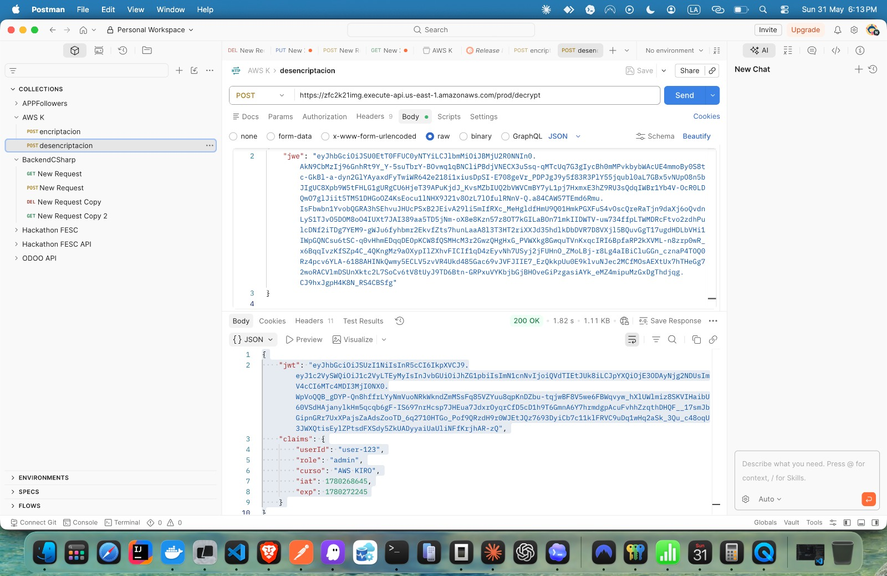

# jose-decryptor

AWS Lambda que recibe un token JWE y retorna el payload JSON desencriptado junto con el JWT verificado.

## Arquitectura

```
POST /decrypt { jwe: "eyJ..." }
       │
       ▼
  validateDecryptInput()   ← valida formato compacto (5 partes separadas por '.')
       │
       ▼
  keyStore.getKeys()       ← recupera claves RSA desde AWS Secrets Manager
       │
       ▼
  decryptJWE(jwe, privateKey)     ← desencripta JWE con RSA-OAEP-256 + A256GCM
       │
       ▼
  verifyJWT(jwt, publicKey)       ← verifica firma RS256 del JWT contenido
       │
       ▼
  HTTP 200 { jwt: "eyJ...", claims: {...} }
```

## Dependencias

| Paquete | Versión | Uso |
|---------|---------|-----|
| `jose` | ^5.9.6 | Desencriptación JWE (RSA-OAEP-256 + A256GCM) y verificación JWT (RS256) |
| `@aws-sdk/client-secrets-manager` | ^3.700.0 | Recuperación de claves RSA desde Secrets Manager |

## Variables de entorno

| Variable | Descripción | Default |
|----------|-------------|---------|
| `PRIVATE_KEY_SECRET_NAME` | Nombre del secreto (clave privada RSA PKCS#8) | `jwt-jwe/private-key` |
| `PUBLIC_KEY_SECRET_NAME` | Nombre del secreto (clave pública RSA SPKI) | `jwt-jwe/public-key` |
| `AWS_REGION` | Región AWS | provisto por Lambda runtime |

## Contrato de interfaz

**Input:**
```json
POST /decrypt
{
  "body": "{\"jwe\": \"eyJhbGciOiJSU0EtT0FFUC0yNTYiLCJlbmMiOiJBMjU2R0NNIn0.ABC...\"}"
}
```

**Output exitoso (HTTP 200):**
```json
{
  "statusCode": 200,
  "headers": { "Content-Type": "application/json" },
  "body": "{\"jwt\": \"eyJhbGciOiJSUzI1NiIsInR5cCI6IkpXVCJ9...\", \"claims\": {\"userId\": \"abc123\", \"role\": \"admin\", \"iat\": 1700000000, \"exp\": 1700003600}}"
}
```

**Códigos de error:**

| Condición | HTTP |
|-----------|------|
| `jwe` ausente o sin formato compacto (≠ 5 partes) | 400 |
| JWE no puede ser desencriptado (clave incorrecta o datos corruptos) | 422 |
| Firma del JWT inválida | 401 |
| JWT expirado | 401 |
| Fallo al recuperar claves de Secrets Manager | 500 |

## Algoritmos criptográficos

- **Desencriptación de clave:** RSA-OAEP-256
- **Desencriptación de contenido:** A256GCM
- **Verificación de firma JWT:** RS256 (RSA con SHA-256)

## Pruebas unitarias

### Ejecutar tests

```bash
npm test -- --testPathPattern='tests/unit/decryptor'
```

### Cobertura de tests

| Archivo | Happy path | Casos de error |
|---------|-----------|----------------|
| `handler.test.js` | HTTP 200 con jwt y claims, claims correctos, Content-Type correcto | HTTP 400 (jwe ausente, 4 partes, 6 partes, null, número, JSON inválido), HTTP 422 (JWE corrupto, clave incorrecta), HTTP 401 (firma inválida, JWT expirado), HTTP 500 (KeyStoreError, error inesperado) |
| `jweDecryptor.test.js` | Desencripta JWE válido, retorna string, 3 partes separadas por `.` | DecryptionError (JWE corrupto, clave incorrecta), statusCode 422, mensaje sin detalles internos |
| `jwtVerifier.test.js` | Retorna `{ jwt, claims }`, claims correctos, iat/exp presentes, jwt es string original | SignatureError (clave incorrecta, JWT manipulado), statusCode 401, TokenExpiredError (JWT expirado), statusCode 401 |

### Resultado de los tests

```
PASS tests/unit/decryptor/handler.test.js
PASS tests/unit/decryptor/jweDecryptor.test.js
PASS tests/unit/decryptor/jwtVerifier.test.js

Tests: 28 passed
```


## Evidencia de funcionamiento

### JWE de entrada → payload desencriptado

**Input:** JWE compacto producido por `jose-encryptor`.

**Output:** `200 OK` con JWT verificado (RS256) y claims originales.

```json
{
  "jwt": "eyJhbGciOiJSUzI1NiIsInR5cCI6IkpXVCJ9...",
  "claims": {
    "userId": "user-123",
    "role": "admin",
    "curso": "AWS KIRO",
    "iat": 1780268645,
    "exp": 1780272245
  }
}
```


