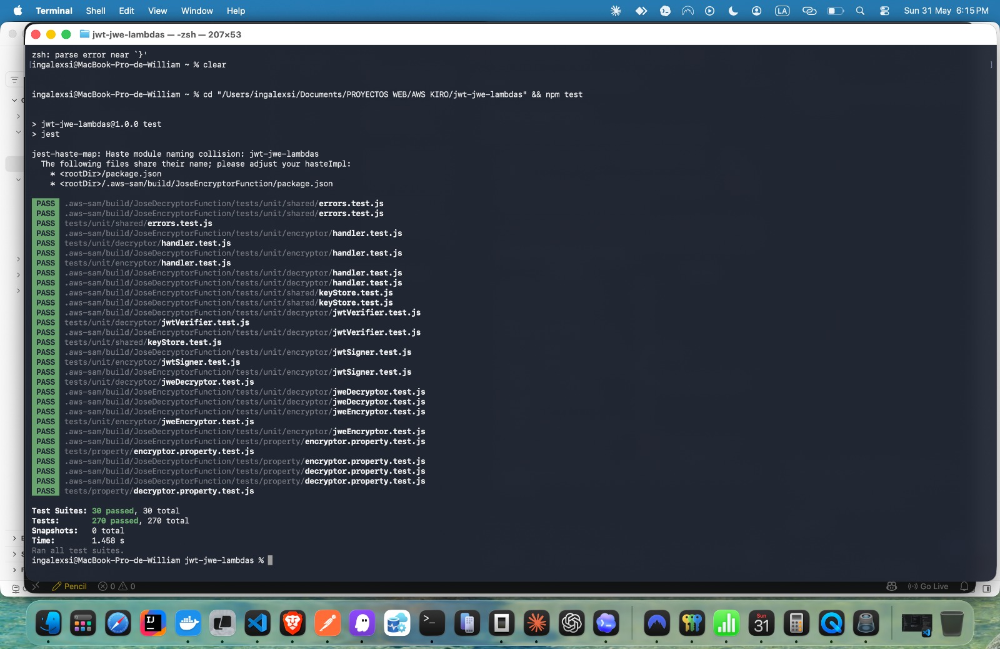
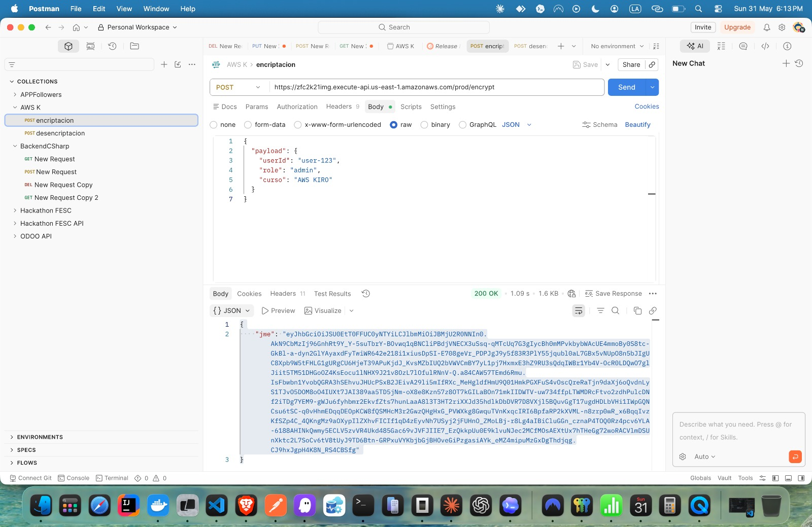

# jose-encryptor

AWS Lambda que recibe un payload JSON y retorna un token JWE encriptado.

## Arquitectura

```
POST /encrypt { payload: {...} }
       │
       ▼
  validateEncryptInput()   ← valida que payload sea objeto JSON
       │
       ▼
  keyStore.getKeys()       ← recupera claves RSA desde AWS Secrets Manager
       │
       ▼
  signJWT(payload, privateKey)    ← firma JWT con RS256
       │
       ▼
  encryptJWT(jwt, publicKey)      ← encripta JWT como JWE (RSA-OAEP-256 + A256GCM)
       │
       ▼
  HTTP 200 { jwe: "eyJ..." }
```

## Dependencias

| Paquete | Versión | Uso |
|---------|---------|-----|
| `jose` | ^5.9.6 | Firma JWT (RS256) y encriptación JWE (RSA-OAEP-256 + A256GCM) |
| `@aws-sdk/client-secrets-manager` | ^3.700.0 | Recuperación de claves RSA desde Secrets Manager |

## Variables de entorno

| Variable | Descripción | Default |
|----------|-------------|---------|
| `PRIVATE_KEY_SECRET_NAME` | Nombre del secreto (clave privada RSA PKCS#8) | `jwt-jwe/private-key` |
| `PUBLIC_KEY_SECRET_NAME` | Nombre del secreto (clave pública RSA SPKI) | `jwt-jwe/public-key` |
| `JWT_EXPIRATION` | Expiración del JWT generado | `1h` |
| `AWS_REGION` | Región AWS | provisto por Lambda runtime |

## Contrato de interfaz

**Input:**
```json
POST /encrypt
{
  "body": "{\"payload\": { \"userId\": \"abc123\", \"role\": \"admin\" }}"
}
```

**Output exitoso (HTTP 200):**
```json
{
  "statusCode": 200,
  "headers": { "Content-Type": "application/json" },
  "body": "{\"jwe\": \"eyJhbGciOiJSU0EtT0FFUC0yNTYiLCJlbmMiOiJBMjU2R0NNIn0.ABC123...\"}"
}
```

El JWE retornado tiene exactamente **5 partes** separadas por `.` (formato compacto RFC 7516).

**Códigos de error:**

| Condición | HTTP |
|-----------|------|
| `payload` ausente o no es objeto JSON | 400 |
| Fallo al recuperar claves de Secrets Manager | 500 |

## Algoritmos criptográficos

- **Firma JWT:** RS256 (RSA con SHA-256)
- **Encriptación de clave:** RSA-OAEP-256
- **Encriptación de contenido:** A256GCM

## Pruebas unitarias

### Ejecutar tests

```bash
npm test -- --testPathPattern='tests/unit/encryptor'
```

### Cobertura de tests

| Archivo | Happy path | Casos de error |
|---------|-----------|----------------|
| `handler.test.js` | HTTP 200 con JWE válido, Content-Type correcto | HTTP 400 (payload ausente, string, número, array, null, booleano, JSON inválido), HTTP 500 (KeyStoreError, error inesperado) |
| `jwtSigner.test.js` | JWT verificable con clave pública, headers correctos (alg/typ), claims iat/exp presentes, claims del payload, payload vacío, payload anidado, JWT_EXPIRATION env | — |
| `jweEncryptor.test.js` | JWE con 5 partes, desencriptable con clave privada, headers RSA-OAEP-256/A256GCM, encriptación de JWT real | — |

### Resultado de los tests

```
PASS tests/unit/encryptor/handler.test.js
PASS tests/unit/encryptor/jwtSigner.test.js
PASS tests/unit/encryptor/jweEncryptor.test.js

Tests: 24 passed
```



## Evidencia de funcionamiento

### Payload de entrada → JWE resultante

**Input:**
```json
{
  "payload": {
    "userId": "user-123",
    "role": "admin",
    "curso": "AWS KIRO"
  }
}
```

**Output:** `200 OK` con JWE en formato compacto (5 partes separadas por `.`, RSA-OAEP-256 + A256GCM).


